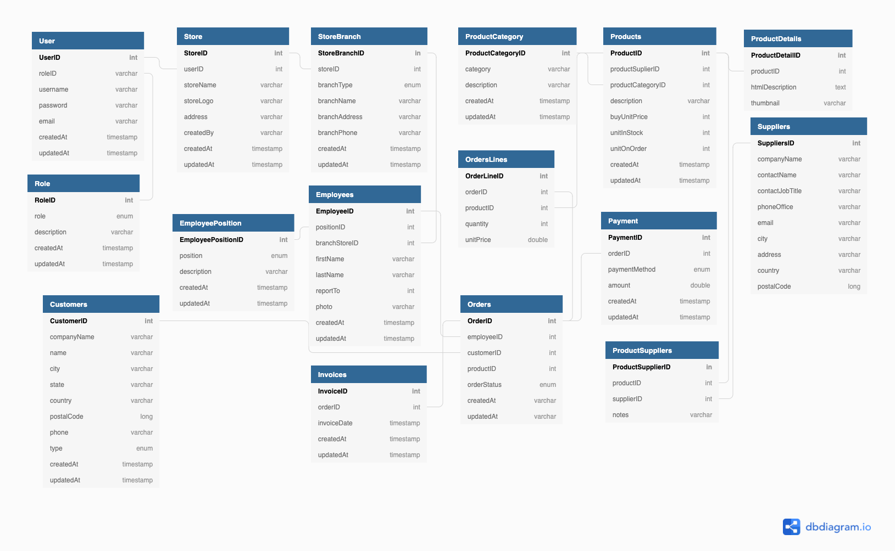

# CashierBackend
BackendCashierApp

Ref
https://dbdiagram.io/d/61c9bf203205b45b73ce0d6b

# Feature
1. Login  
    - email ,password
    - google 
3. Register
    - google
    - email,password
4. Create Store
    - Create Branch(for first auto generate main branch)
    - Update Branch
    - Delete Branch
5. Employees
    - Add employee to branch
    - edit employee
    - 
   
6. Products
    - add new product
    - purchase
        - update stock
        
    - sale
        - update stock
7. Orders
    - order
        - payment
    - hold order
8. 

# Flow
1. User
   - Auth
      - User Login With email and password/username and password
      - User register with email or google
      - User Login with Google
      - User Reset Password with email
   - Store
      - Create Store for first time(1 user can create only 1 store)
      - Update Store 
      - Create Branch(auto create when create store in first time)
      - Update Branch
   - Supplier (store have 2 type 1. must stock product from supplier(ex retail) 2. store that no need purchase from supplier (ex restaurant))
      - Add new Supplier
      - Edit Supplier
      - Delete Supplier
   - Product
      - Edit Product 
      - Add New Product 
      - Delete Product
2. Employee
   - Auth
      - Login
      - Reset Password
   - Product
      - Edit Product
      - Add New Product
      - Delete Product
      - Purchase Product from suppliers(update stock product)
   - Supplier(store have 2 type 1. must stock product from supplier(ex retail) 2. store that no need purchase from supplier (ex restaurant))
      - Add new Supplier
      - Edit Supplier
   - Order
      - Sale Product to customer(update stock)
      - Add Costumer

# Getting Started

### Reference Documentation

For further reference, please consider the following sections:

* [Official Apache Maven documentation](https://maven.apache.org/guides/index.html)
* [Spring Boot Maven Plugin Reference Guide](https://docs.spring.io/spring-boot/docs/2.6.2/maven-plugin/reference/html/)
* [Create an OCI image](https://docs.spring.io/spring-boot/docs/2.6.2/maven-plugin/reference/html/#build-image)
* [Spring Security](https://docs.spring.io/spring-boot/docs/2.6.2/reference/htmlsingle/#boot-features-security)
* [Validation](https://docs.spring.io/spring-boot/docs/2.6.2/reference/htmlsingle/#boot-features-validation)
* [Spring Data JPA](https://docs.spring.io/spring-boot/docs/2.6.2/reference/htmlsingle/#boot-features-jpa-and-spring-data)
* [Spring Web](https://docs.spring.io/spring-boot/docs/2.6.2/reference/htmlsingle/#boot-features-developing-web-applications)

### Guides

The following guides illustrate how to use some features concretely:

* [Securing a Web Application](https://spring.io/guides/gs/securing-web/)
* [Spring Boot and OAuth2](https://spring.io/guides/tutorials/spring-boot-oauth2/)
* [Authenticating a User with LDAP](https://spring.io/guides/gs/authenticating-ldap/)
* [Accessing Data with JPA](https://spring.io/guides/gs/accessing-data-jpa/)
* [Building a RESTful Web Service](https://spring.io/guides/gs/rest-service/)
* [Serving Web Content with Spring MVC](https://spring.io/guides/gs/serving-web-content/)
* [Building REST services with Spring](https://spring.io/guides/tutorials/bookmarks/)

